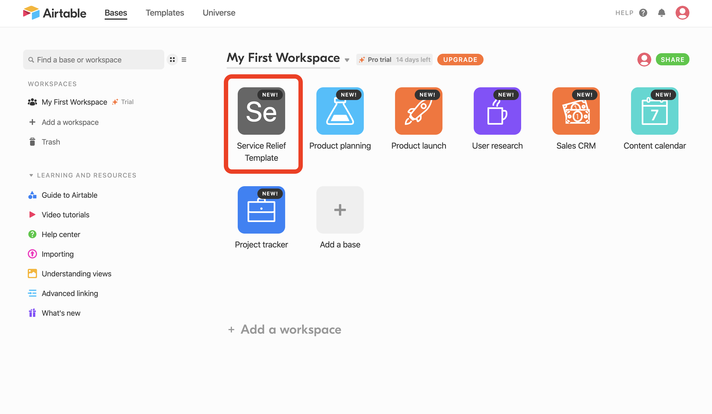
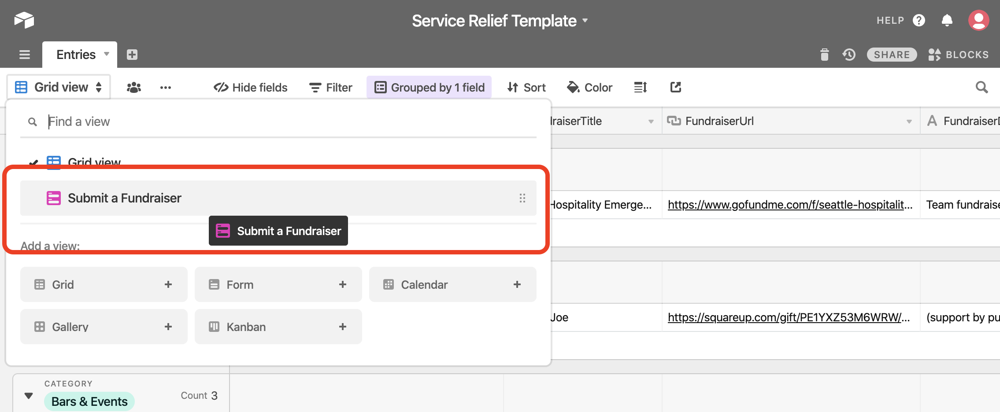
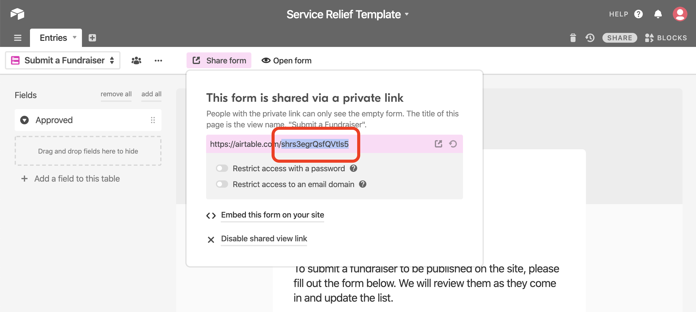
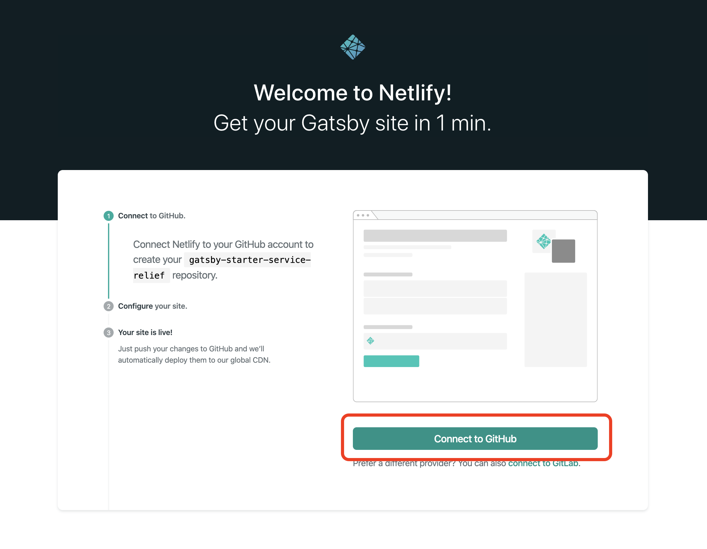
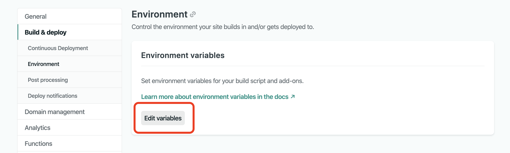

<!-- AUTO-GENERATED-CONTENT:START (STARTER) -->
<p align="center">
  <a href="https://www.gatsbyjs.org">
    
  </a>
</p>
<h1 align="center">
  Service Relief Starter
</h1>

Kick off your city's relief efforts as we all learn to cope with COVID-19 with this starter powered by Gatsby, Airtable, and community efforts.

## 🔧 Configuring a new site

You can get a service relief site up and running without touching any code! You'll need to (possibly) make a few accounts with free tiers from different websites and have two important things configured to have your site working correctly:

1. An **Airtable base** (like a fancier Google Sheet or Excel spreadsheet): this is where the information to populate fundraisers on the site comes from
2. A **copy of the code for the site**: this is what defines how the site looks, and takes your data to display on a webpage

### Airtable configuration

To setup Airtable, you can automatically create a new base configured for a service relief site by following this link: [https://airtable.com/addBaseFromShare/shroKwQGVsips8KI2?utm_source=airtable_shared_application](https://airtable.com/addBaseFromShare/shroKwQGVsips8KI2?utm_source=airtable_shared_application)

#### Registering and exploring the Service Relief Template

It will first prompt you to make an account if you don't have one, fill in name, email, and password and create an account. You can skip the onboarding flow prompts that Airtable pops up (but it's okay if you do them too).

Then you should see several tiles that correspond to individual "Bases" that Airtable has set up for you. You care about the one that was created based on the link you followed above, it should have created a base called "Service Relief Template".



If you click on the link you can explore the data prepoulated in it.

<!-- TODO add information about what NOT to delete and how to add records -->

#### Collecting keys and information you need from Airtable

Now with a base setup, you will need to collect **4 values** from Airtable that the code on your site will use to get information from Airtable automatically.

1. Your **API key**: this is yours and yours alone, your site can use it to prove to Airtable that your account is trying to get information, sort of like a key for a safe deposit box

Find your API key by navigating to your account at this link: [https://airtable.com/account](https://airtable.com/account), you should see a section labeled API and a button to "Generate API key".


Click the button and and then click on the dots to show your key, copy it somewhere you can access it when you're setting up your site.


1. The Service Relief Template **Base ID**: the base is where all your tables are stored, Airtable needs to know which base to grab data from.

Find your Base ID by navigating to this link: [https://airtable.com/api](https://airtable.com/api), if you are signed in and have created a base from the provided template you should see a list of bases in your workspace. Click on the one called "Service Relief Template".


1. The Service Relief Template **Table ID**: a table ID is needed by your site to tell Airtable what table of information to get the data from, out of the base that you provide (with the Base ID).

Find your Table ID by clicking on your "Service Relief Template" from the home page (when signed in): [https://airtable.com/](https://airtable.com/)

Then the ID can be found in the URL (or part of the website domain) between after the first slash ("/") and second slash (`https://airtable.com/your-table-id-is-in-this-section/viwJTsGfqvhs47lq5`). For example, if my Service Relief Template has this url: `https://airtable.com/tblPUzBVNnTqzCxYm/viwJTsGfqvhs47lq5`, my Table ID would be the part after `airtable.com/` and before `viwJTsGfqvhs47lq5`. You'll know it's your Table ID because it's prepended with `tbl`, in this case it's: `tblPUzBVNnTqzCxYm`.


1. The Service Relief Template's **submission form embed ID**: this is connected to a submission form that was created for you that will allow users on the site to submit potential fundraisers directly to your Airtable base, nice!

Find you submission form embed ID by clicking on "Grid View" at the top left of your base, and selecting "Submit a Fundraiser".



This will take you to the form view, which should display a submission form that was automatically created when your base was created by the template. To get this ID, you need to click the "Share Form" button, then you should see a link, copy everything after `https://airtable.com/`



With all 4 values copied. You are ready to set up the code portion of the site.

### Code configuration

You will need to copy the code from this site and deploy it to make it available to anyone visitng your page on the internet, the place that your webpage's files live is where it is hosted. The easiest way to do so is by clicking on a set up button which will help you get setup a hosting service. These steps have instructions for Netlify though the process is very similar for other providers. You only need to choose one.

This button is for Netlify:

[](https://app.netlify.com/start/deploy?repository=https://github.com/service-relief/gatsby-starter-service-relief)

And this is for Zeit Now:

[](https://zeit.co/import/project?template=https://github.com/service-relief/gatsby-starter-service-relief)

When you click on one of these buttons, the link will take you to the service and start you on the setup process by making 2 accounts, one on the hosting service, and one on GitHub. The hosting service will add your code to GitHub (a code storing service) for you and prompt you to create an account for it as well.

#### Netlify hosting configuration

Clicking on the deploy button will take you to this screen:



Click "Connect to GitHub" which will have you setup a GitHub account, you can select a Free plan, but you will need to verify your email to connect it to Netlify.

After connecting, you can name keep the default name (no one will see this but you) and click "Save & Deploy". You will also need to setup a Netlify account now in order to save your site to your account.


Your Netlify account will now be linked to the code that was copied on GitHub, but you need to update some settings (that you found in the steps above) to connect it all to Airtable. Click on "Settings" in the top navigation bar, then select "Build & deploy" from the sidebar on the left, and finally click "Environment" underneath that. Look for a button that says "Edit variables":



These environment settings tell your site how to run specific for your copy of the code. The values you copied before that connect to _your_ Airtable account provided here will populate your site with your data.

Add the following keys and values (key is in all caps, the value is what you copied from Airtable):

```
AIRTABLE_API_KEY=key00000000000000
AIRTABLE_BASE_ID=app00000000000000
AIRTABLE_EMBED_ID=shr0000000000000
AIRTABLE_TABLE_NAME=tbl00000000000
CITY=Provo
STATE=Utah
```

The final two keys added are the city and state you are creating your site for. This will populate content in the body of the site. The example above uses 000's in place of real keys because you will need to replace those values with the ones that you copied from your Airtable account.

Hit "Save" once you have added in all 6 or your values and you should have everything connected to Airtable when your site is deployed.

Scroll to the tope and navigate to the "Deploys" section and Trigger a new deploy with "Trigger Deploy", "Deploy Site" or "Clear cache and deploy site". When it's finished you should be able to click on the link provided by Netlify:


##### Update site name

You can change the site name or update the domain your site displays in "Settings" > "General" > "Site Details".
